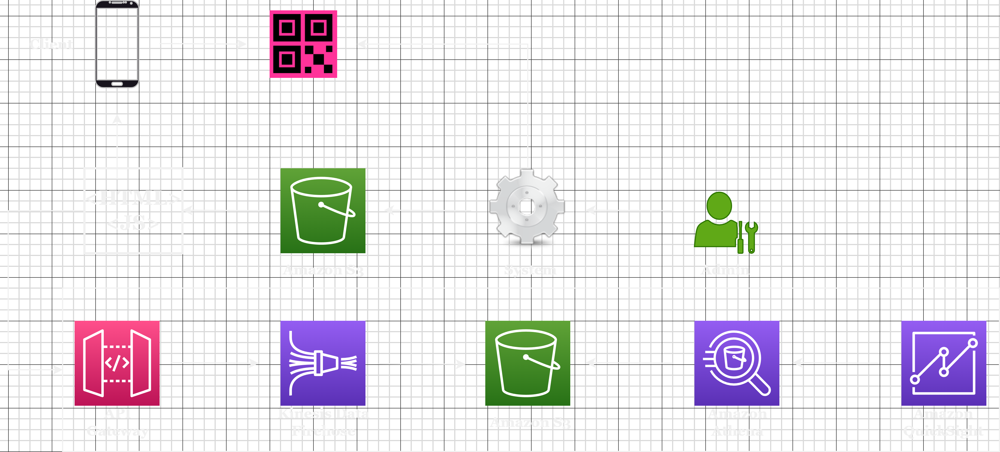

*Customer Use Case:*
The customer operates a tech-enabled solution for restaurants, providing them with digital menus via an S3 static website. Each restaurant admin can update their menu items within this system, and the updated menus are accessible to customers through a QR code available at restaurant tables.     
Currently, the service uses an S3 static website to host HTML webpages containing restaurant menus. Restaurant admins can log into a system to update their menu in real-time. A QR code is generated, pointing to the S3 bucket, which restaurants then use on their tables. 

*Solution Overview:* The solution is centered around using Amazon Web Services (AWS) to handle the ingestion, storage, analysis, and visualization of clickstream data from a JavaScript library the business has already built. API Gateway provides the HTTPS endpoint for the JavaScript library to send the clickstream data to. API Gateway is acting as a proxy in this architecture. The data ingested from the API Gateway is sent to Kinesis Data Firehose, which is the primary data ingestion mechanism. The service is chosen as it avoids exposing Kinesis Data Firehose API endpoints on the internet. After being ingested through Kinesis Data Firehose, the data is stored in an S3 bucket. The S3 was chosen because it is detached from any processing or compute or visualization layer, providing flexibility for choosing the right tools for the job. The data stored in S3 is then queried using Athena, which provides SQL functionality. QuickSight is used to visualize the data, enabling the business to draw insights from it. 

*Possible Improvements*         
**Switch to a Serverless Architecture**          
Since the menu update system isn't being used constantly, you could consider replacing the EC2 instance with a serverless service like AWS Lambda. This could potentially save costs, as you would only pay for the compute time you actually consume.

**Amazon CloudFront**           
To speed up the delivery of the restaurant menus stored in S3, consider implementing Amazon CloudFront. CloudFront would cache the menus and deliver them from a location close to the clients, improving response times and reducing the cost associated with data transfers.

**Replace API Gateway with Amazon Cognito**           
To provide identity pools for authorization, replace the API Gateway with Amazon Cognito. This could allow the clients to send requests directly to Firehose after authentication, reducing the need for, and the cost of, the API Gateway.

**AWS CloudFormation for Reproducibility**            
To make the solution easily reproducible, consider using AWS CloudFormation templates. This would make the system easier to replicate for different customers, and facilitate separated billing and improved governance.
