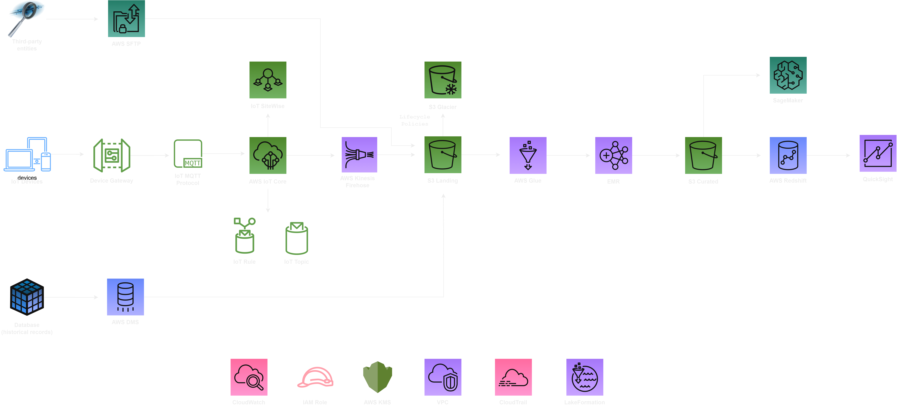

*Customer Use Case:* A company is planning to use Amazon Simple Storage Service (Amazon S3) as the storage layer for their data lakes solution. Initially, the data that will be ingested into the data lake will come from three locations:
- Internet of Things (IoT) sensors that send real-time data;
- A database with historical records;
- Supplemental data from third-party entities for enriching internally generated data;
The company has tasked you with designing solutions for ingesting this data into their data lake, and each location (IoT sensors, database, and third party) will need its own ingestion solution. From there, you will need to also design a solution for how to clean or transform the data so that it can be analyzed. The company currently uses Apache Hadoop-based software. When possible, they prefer to use similar technologies in the cloud so that they don’t need to retrain their analytics team on too many new technologies at one time. The company also has a requirement to create dashboards that show visual representations of the insights they derive from the data.

*Solution Overview:*
Data Assimilation: Our process encompasses a set of disparate data sources:
- Internet of Things (IoT) gadgets transmit real-time data utilizing a device gateway and the IoT MQTT protocol. This information is channeled through the AWS IoT Core and potentially AWS IoT Sitewise, depending on the requirements.
- We retrieve historical data from an established database.
- Third-party entities furnish us with additional, supplemental data.

Our AWS-centric system operates as follows: 

AWS IoT Core: This entity is the reception point for data emanating from the IoT devices. A defined rule facilitates data routing to an IoT Topic.       
AWS IoT Sitewise: This service is responsible for the gathering, arrangement, and monitoring of data from the IoT devices.      
Kinesis Firehose: This tool streams data from the IoT Topic, dispatching it to our data lake stored in Amazon S3.      
AWS Glue: This service is instrumental in both the discovery and cataloging of data from the database and third-party entities. Furthermore, it can transform the data before its deposition in S3, creating a curated subset.      
Amazon S3 Landing: The raw data from the trio of sources (IoT devices, database, third-party entities) finds a resting place here.      
AWS Glue ETL Jobs: This service purifies, morphs, and readies the raw data for subsequent analysis. The transformed data is securely stored in a distinct S3 bucket.      
Amazon EMR: This cloud-native big data platform processes the landed data, utilizing distributed processing to handle immense data volumes.      
Amazon S3 Curated: The cleaned, transformed or, as we like to call it, "curated" data, is safely stored here, distinctly separate from the raw data.      
Amazon Redshift: The processed data is then loaded into Redshift, a data warehouse with petabyte-scale capabilities where the data undergoes analysis.      
Amazon SageMaker: SageMaker, a fully managed machine learning service, can utilize the curated data from S3 to train and deploy machine learning models.      
Amazon QuickSight: The culmination of our process sees the results from Redshift (or machine learning models from SageMaker) visualized in QuickSight. This service facilitates the creation and publication of dashboards that are accessible across devices and embeddable in your applications.      

To ensure top-notch security, resource monitoring, and access control, we employ the following key services:

AWS Lake Formation: This service streamlines and automates the setup and management of the S3 data lake.      
IAM Roles: These are designed to control access to AWS services and resources.      
KMS: This is used to generate and manage cryptographic keys, which are crucial for data encryption.      
VPC: This private network allows for the launch and management of AWS resources.      
CloudWatch: This monitoring service provides data and actionable insights for applications and services.      
CloudTrail: This service enhances governance, compliance, operational auditing, and risk auditing of the AWS account.      
