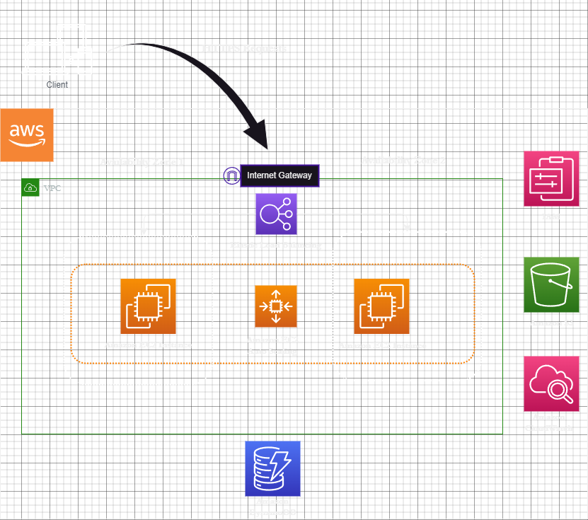

The application is structured within a private network via Amazon Virtual Private Cloud (VPC). It operates on Amazon Elastic Compute Cloud (EC2), which provides virtual machines in the AWS environment, serving as the core for the application's backend code.

Our database, hosting employee data, is contained within the same network, facilitated by Amazon DynamoDB, a NoSQL database service that offers fast and predictable performance with seamless scalability.

Employee images are stored using Amazon Simple Storage Service (S3), a service with limitless capacity for storing any file type, such as the images in our use case.

To monitor the solution, we employ Amazon CloudWatch, ensuring that we capture and track metrics, collect and monitor log files, and respond to system-wide performance changes.

To enhance the scalability and fault tolerance of our application, we incorporate Amazon Elastic Load Balancing and Amazon EC2 Auto Scaling. This allows the system to distribute incoming traffic across multiple targets and to scale resources to meet demand.

For security and identity management, we utilize Amazon Identity and Access Management (IAM), safeguarding access to AWS resources.

This setup forms the fundamental structure of our application, striking a balance between security, scalability, and performance.
