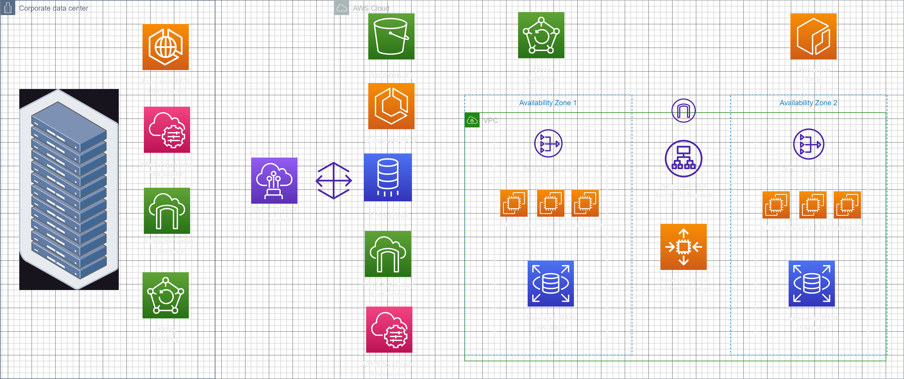

*Customer Use Case:* The customer is a company that has been gradually migrating workloads to AWS as their data center contracts expire. Currently, they are in a situation where half of their servers have expired contracts, and half do not. They want to migrate half of their workloads to AWS, while the other half remains on-premises for the next few years, thus implementing a hybrid cloud deployment. The customer's infrastructure involves a network of servers, with the primary workload consisting of applications running in containers, except for databases. These applications are internal and need to be accessed by different environments (on-premises and AWS) without exposure to the internet.

*Solution Overview:* The solution implements AWS Direct Connect to establish a private connection from the client's data center to AWS. This connection provides higher bandwidth, consistent network performance, and lower data transfer costs. Amazon ECS (Elastic Container Service) is used for container orchestration in AWS. The on-premises containers that are not migrated will also be managed by ECS using the ECS Anywhere feature. The architecture contemplates both Docker Hub and Amazon ECR (Elastic Container Registry) as potential container registries (open for changes based on client preference). Amazon EC2 (Elastic Compute Cloud) instances have been chosen as the underlying resources to run the containers. It also includes EC2 Auto Scaling to manage the scale of the cluster. Application Load Balancer is selected for load balancing the containers. For PostgreSQL databases, the solution proposes Amazon RDS with a Multi-AZ  deployment. AWS Storage Gateway is added to allow the on-premises containers to store files on AWS using NFS (Network File System). It caches the files locally in the data center and asynchronously pushes them to Amazon S3 for long-term storage. The EC2 instances running the ECS cluster and the RDS instances are placed in private subnets within a VPC. A NAT gateway and a public subnet in each AZ are set up for egress communication with the public internet. AWS Systems Manager is included to manage resources and operational tasks both in AWS and on-premises. AWS Backup is used to centralize backup tasks across environments.

*Possible Improvements:*        
**Disaster Recovery (DR) Plans**           
  *Backup and restore:* Mitigates data loss and allows for quick infrastructure redeployment. AWS CloudFormation or AWS CDK should be used for deploying infrastructure as code (IaC).            
  *Pilot light:* Replicates data and core workload infrastructure. Core infrastructure is always available, providing the ability to quickly provision a full scale production environment when needed.               
  *Warm standby:* Provisioning a scaled-down version of your production environment in another Region, reducing recovery time.                 
  *Multi-site active/active:* Running your workload simultaneously in multiple Regions. This approach can reduce your recovery time to near zero for most disasters.                 

**AWS Direct Connect with AWS VPN for failover**           
This setup would allow a redundant connection to AWS, which can switch over to the VPN connection if the AWS Direct Connect connection becomes unavailable.

**Automatic Scaling for Containers**     
Scaling considerations should be given to both the underlying EC2 cluster and the containers themselves.           
  *Scaling the cluster:* Utilize Amazon ECS Auto Scaling group capacity provider with managed scaling for efficient scale-in and scale-out actions.           
  *Scaling the containers:* Configure Amazon ECS service to automatically scale its desired count of tasks, either up or down, in response to CloudWatch alarms.

**Automatic Scaling for Amazon RDS**                 
Enable storage autoscaling, where Amazon RDS automatically scales up your storage when it detects that you're running out of free database space.

**Amazon S3 Intelligent-Tiering**            
Implement S3 Intelligent-Tiering on the S3 bucket to optimize storage costs by automatically moving data to the most cost-effective access tier when access patterns change. This is especially useful for data with unknown, changing, or unpredictable access patterns.
