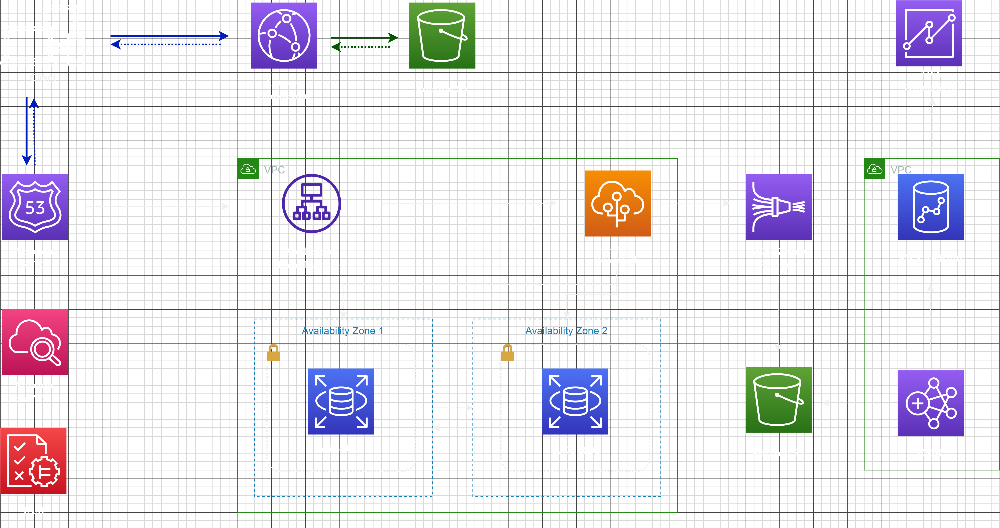

*Customer Use Case:* We are working for a customer that runs their workloads on premises. The customer has two workloads:
- A three-tier architecture composed of a frontend (HTML, CSS, JavaScript), backend (Apache Web Server and a Java application), and database (MySQL). The three-tier application hosts a dynamic website that accepts user traffic from the internet.
- A data analytics workload that runs Apache Hadoop. The analytics workload analyzes a massive amount of data that stored on premises and it also uses visualization tools to derive insights.
- 
These components are currently running in the data center on physical servers. Currently, if a power outage occurred in the data center, all systems would be brought offline. Because of this issue (in addition to other benefits of the cloud), your customer wants to migrate all components to the cloud and, when possible, use AWS services to replace on-premises components.

*Solution Overview:* 
The client sends a request to access the web application. The Domain Name System (DNS) translates the domain name 
into the IP address of Amazon Route 53, which is a highly available and scalable DNS web service. CloudFront is a content 
delivery network (CDN) that delivers data, videos, applications, and APIs to users globally with low latency and high 
transfer speeds. This provides benefits like lower latency for users, protection against network and application layer 
DDoS attacks, and more efficient content delivery. Amazon CloudFront is connected to an Amazon S3 bucket, which 
hosts the static website content. This content is cached at CloudFront's edge locations, allowing for efficient and quick 
delivery to the user. For dynamic content, Amazon Route 53 directs the traffic to an Application Load Balancer (ALB). The 
ALB automatically distributes incoming application traffic across multiple targets, such as Amazon EC2 instances.
The ALB directs traffic to your Elastic Beanstalk environment, where your backend application (Apache Web Server and a 
Java application) is running. Elastic Beanstalk is an easy-to-use service for deploying and scaling web applications and 
services. Elastic Beanstalk application communicates with an Amazon RDS instance, which is running in a private subnet 
within a VPC. Amazon RDS makes it easy to set up, operate, and scale a relational database in the cloud. It provides costefficient and resizable capacity. Multi AZ feature was used to increase accessibility and be more durable. Elastic 
Beanstalk also sends data to Amazon Kinesis Firehose for real-time data processing. This could include application logs, 
user activity tracking, etc. Kinesis Firehose captures, transforms, and loads data streams into AWS data stores, in this 
case, Amazon S3. Amazon EMR then uses this data stored in S3 for big data processing and analysis. The results of this 
processing can then be loaded into Amazon Redshift for further analysis. Redshift is a fast, fully managed, petabyte-scale 
data warehouse that makes it simple and cost-effective to analyze all data. Amazon QuickSight, a business intelligence 
service, is used for visualizing the data residing in Redshift. This helps in deriving meaningful insights from the data. AWS
Identity and Access Management (IAM) is used for managing access to all AWS services and resources securely. Using 
IAM, one can create and manage AWS users and groups, and use permissions to allow and deny their access to AWS 
resources. Amazon CloudWatch is used to collect and track metrics, collect and monitor log files, set alarms, and 
automatically react to changes in AWS resources. 

*Justification for selected Strategy:*

**Frontend Hosting (Amazon S3 vs. EC2):**      
Here we could choose between hosting our static content on an EC2 instance or using Amazon S3. We chose Amazon S3 
because it's designed to store and retrieve any amount of data at any time from anywhere on the web. It's a highly 
durable, scalable, and secure solution for object storage. Also, when combined with Amazon CloudFront, it provides an 
efficient way to distribute static content to users with low latency.
If we had chosen EC2, we would have to manually handle scaling, security, and availability, which are automatically taken 
care of by S3.

**Backend Hosting (Amazon EC2 vs. Elastic Beanstalk):**    
The backend could have been hosted on a standalone EC2 instance or using Elastic Beanstalk. We chose Elastic Beanstalk 
because it is a fully managed service that takes care of the deployment, from capacity provisioning, load balancing, autoscaling to application health monitoring, while giving you full control over the underlying EC2 instances.
If we had chosen a standalone EC2 instance, the team would need to manage these aspects manually. This could 
potentially increase the complexity and the operational overhead of the solution.

**Database (EC2 with self-managed MySQL vs. Amazon RDS):**      
We had a choice between running a self-managed MySQL database on an EC2 instance or using Amazon RDS. We chose 
Amazon RDS as it is a managed service that makes it easier to set up, operate, and scale a relational database in AWS. It 
provides cost-efficient resizable capacity while automating time-consuming administration tasks such as hardware 
provisioning, database setup, patching, and backups.
If we had chosen a self-managed MySQL database on EC2, the team would have to handle database management tasks 
manually and potentially handle scalability and availability issues, which are automatically managed by RDS.
