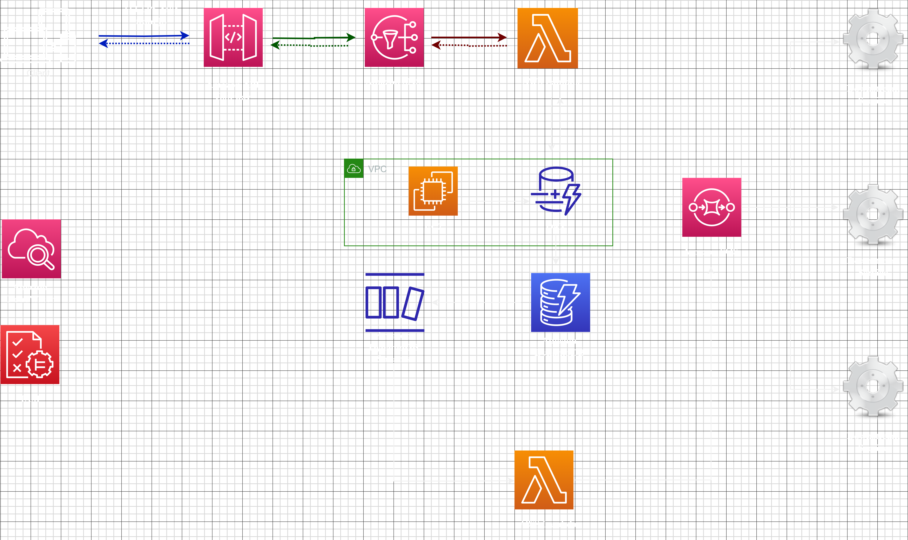

*Customer Use Case:* The customer operates an international cleaning products company. They offer their products both to individual consumers via a website and an app, and to buyers who purchase their products wholesale. The company currently utilizes an on-premises orders service to process, authenticate, validate, and store all orders coming in from various interfaces. This service also communicates with downstream services like inventory fulfillment and accounting, both of which are already hosted in the AWS Cloud.

*Solution Description:* Customers will place their orders through various frontend clients like their mobile phones or browsers. These requests will be directed to Amazon API Gateway, which acts as the entry point for the orders API. API Gateway will handle authentication and validation of incoming requests, ensuring they contain all the necessary information. Validated and authenticated requests are then sent to an Amazon Simple Queue Service (SQS) queue, decoupling the API from compute. This ensures no messages get lost during high traffic periods as they remain in the queue until processed. A Lambda function, equipped with a built-in polling mechanism, is triggered to process messages from the SQS queue. If necessary, Lambda limits can be raised to process messages more quickly. The Lambda function also houses the application code for order processing and storing orders in an Amazon DynamoDB table. \ Entries added to the DynamoDB table are also added to a DynamoDB stream. Another Lambda function processes this stream to publish the order information to Amazon Simple Notification Service (SNS). Using a fan-out pattern, Amazon SNS broadcasts the message to all subscribed endpoints, namely the downstream services for fulfillment, accounting, and inventory.       
In terms of monitoring and logging, all of these services are serverless and have built-in integrations to send metrics and logs to Amazon CloudWatch and Amazon CloudWatch Logs, reducing the need for extra configuration.            
Scalability is managed for all these services. For some, like Lambda or DynamoDB, you can still control scaling events or manage throughput. However, it is more hands-off compared to services like EC2.        

*Possible Optimizations:*    

**Amazon DynamoDB Accelerator (DAX)**    
DAX is a fully managed, highly available, in-memory cache for DynamoDB that can offer up to a 100-times performance improvement, reducing latency from milliseconds to microseconds. DAX handles the complex operations of adding in-memory acceleration to your DynamoDB tables, eliminating the need for developers to manage cache invalidation, data population, or cluster management. Using DAX doesn't require changes to the application logic as it's compatible with existing DynamoDB API calls.

**AWS Lambda Power Tuning**
This state machine, powered by AWS Step Functions, supports three optimization strategies: cost, speed, and balance.
After providing a Lambda function Amazon Resource Name (ARN) as input, the tool invokes the function with multiple power configurations (from 128 MB to 10 GB, user-defined), analyzes all execution logs, and suggests the best power configuration to minimize cost or maximize performance.

**AWS Lambda Powertools:**
This suite of utilities is designed to facilitate the adoption of best practices such as tracing, structured logging, custom metrics, idempotency, batching, etc. for AWS Lambda functions.

**AWS Lambda execution environment reuse:**
By moving certain initialization tasks outside the handler in your code, they can be reused across invocations, improving function performance and reducing run time.
This approach involves initializing SDK clients and database connections outside the function handler and caching static assets locally in the /tmp directory.
However, to avoid potential data leaks across invocations, do not use the execution environment to store user data, events, or other sensitive information. If your function relies on a mutable state that can't be stored in memory within the handler, consider creating a separate function or separate versions of a function for each user.
