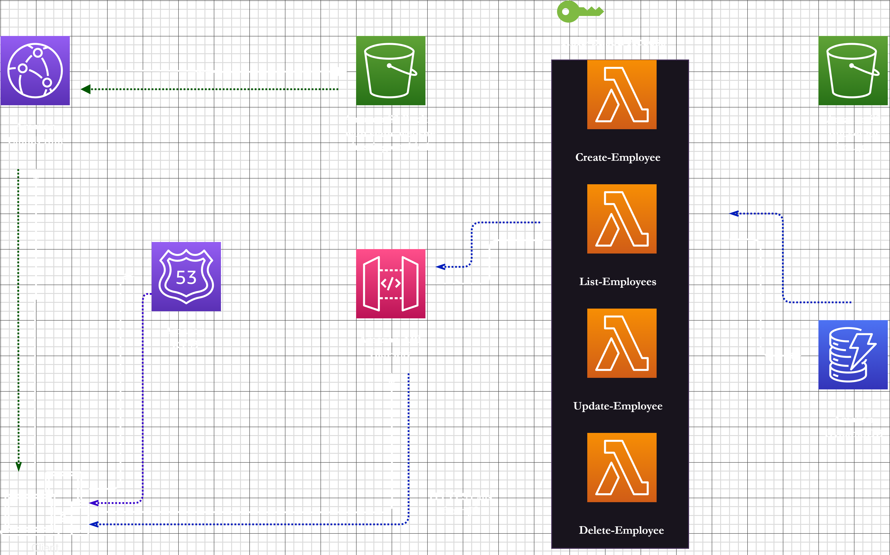

This schema presents an AWS architecture for an employee directory application, segmented into three distinct layers: presentation, application, and data.

The presentation layer, containing the website's user interface, is hosted on Amazon S3. Even though the website dynamically pulls data from a database, it's classified as 'static' due to JavaScript's ability to load dynamic content and modify the page accordingly.

The application layer resides on AWS Lambda. It holds the backend logic for managing employee data and is triggered by events from the presentation layer. To prevent direct interaction between the front and backend, we use the Amazon API Gateway service to host an API, with each employee-related action having its own method.

The data layer with DynamoDB handling the database and Amazon S3 for employee photo storage. Role-based access management is controlled via IAM roles.

To optimize user experience, Amazon Route 53 manages domain names, and Amazon CloudFront caches static assets closer to end users, leveraging AWS Edge locations.

When a user accesses the website, Route 53 redirects to the S3-hosted site. Any API calls to load dynamic content hit the API Gateway, triggering the backend Lambda function. This function queries DynamoDB for employee data, returning it to API Gateway and rendering it on the page.

This architecture prioritizes scalability, operational overhead, and cost-effectiveness. Its serverless nature significantly reduces the operational support required compared to EC2-based workloads. No patching or AMI management is needed, and the networking aspect is managed automatically, though it can be integrated with your VPC for compliance needs.

Ultimately, AWS provides flexibility to swap and automate components as services evolve or gain new features, demonstrating the beauty of building on AWS.
